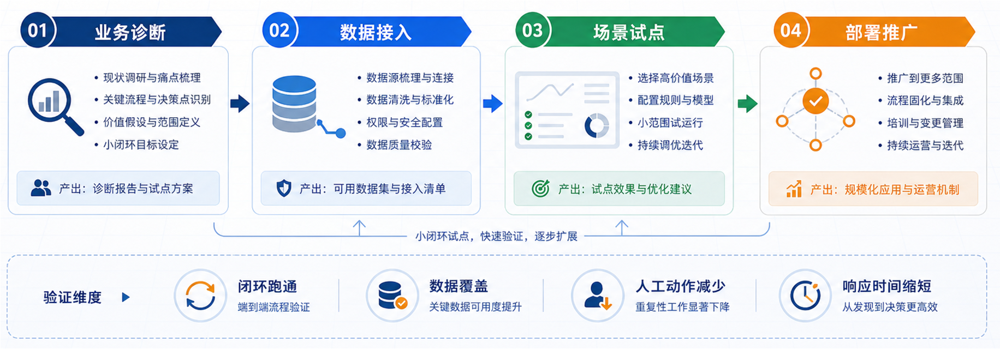
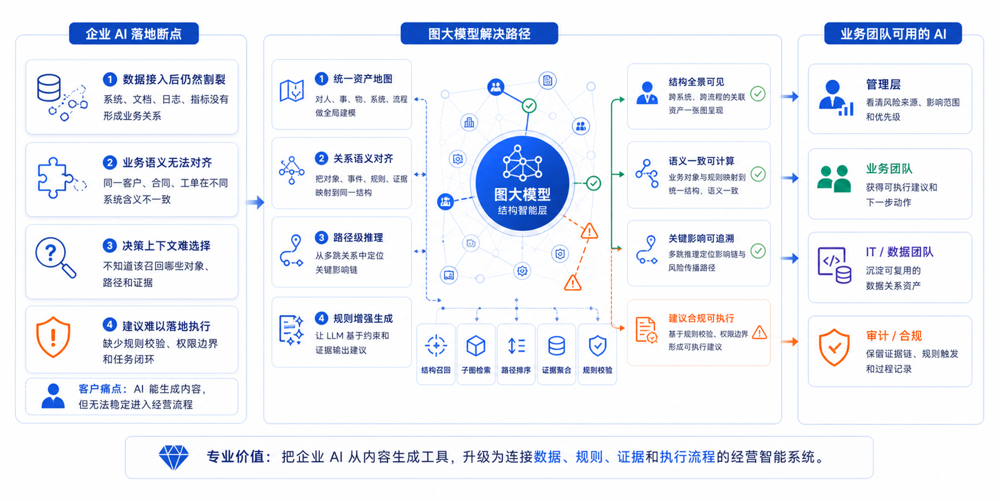
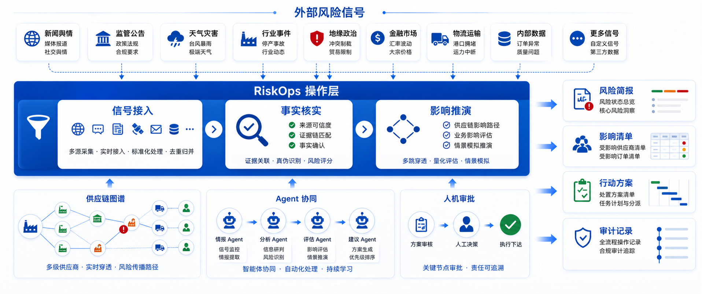
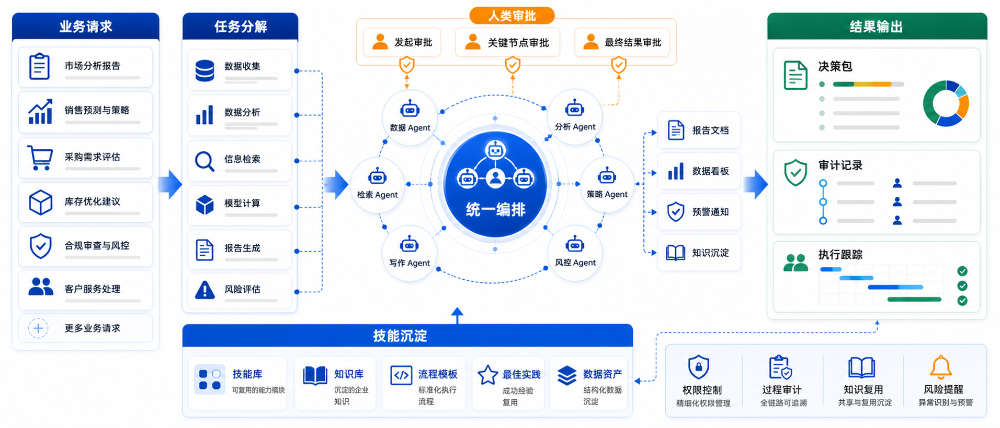

# OptiMax Skills

> OptiMax 维护的企业级 AI Skills，让 AI 不只生成内容，也能稳定交付可直接使用的专业成果。

本仓库沉淀 OptiMax 在产品表达、企业决策和演示设计中的可复用方法。
目前已开放 **OptiMax PPT ImageGen**：把一页 PPT 的主题、结论和业务关系，
转化为风格统一、结构清晰的 21:9 企业级信息图主视觉。

## 已开放的 Skill

### `optimax-ppt-imagegen`

面向中文商业演示的 PPT 主图生成 Skill。它会先整理内容和优化文案，再根据内容类型选择合适的信息结构，默认输出三套设计方案。

三套方案不是简单更换颜色或图标，而是采用不同的阅读路径：

| 方案 | 设计重点 | 常见结构 |
| --- | --- | --- |
| A · 清晰表达 | 最直接、最快理解 | 阶段流程、分层架构、并列对比 |
| B · 管理叙事 | 强调方法、判断与价值 | 输入—引擎—输出、能力—结果、决策路径 |
| C · 系统全景 | 呈现系统关系与持续运转 | 中心辐射、闭环、网络、驾驶舱 |

它适合以下场景：

- 产品架构、技术架构与平台能力图
- 业务流程、实施路径与产品路线图
- 决策机制、风险管理与运营闭环
- 产品价值、解决方案与能力映射
- Agent 协作、组织机制与经营模型
- 数据分析、指标体系与管理看板

## 设计风格

- 21:9 超宽横版构图，顶部预留 PPT 标题区域
- 白色至极浅蓝背景，轻量网格，保持干净留白
- 深海军蓝和强调蓝作为主色，绿色、橙色只承担明确的功能或状态含义
- 圆角白色卡片、细描边、轻阴影、线性图标、流程箭头和节点网络
- 使用简洁、自然的中文标签，避免生硬直译和大段文字
- 不生成公司 Logo、页码、水印、人物照片、3D 卡通或营销海报式装饰

## 快速安装

将 Skill 全局安装到所有受支持的 AI 编程工具：

```bash
npx --yes skills add wherexml/optimax-skills \
  -g --skill optimax-ppt-imagegen --agent '*' -y
```

安装完成后，新开一个 AI 会话即可使用。目标 AI 需要具备图像生成能力；
如果当前环境不能直接生成图片，Skill 会返回三份可直接用于 ImageGen 的完整提示词。

## 使用方法

在 Codex、Claude Code 或其他支持 Skills 的 AI 工具中，直接说明要使用 `$optimax-ppt-imagegen`，并提供页面主题、核心结论和必要内容。

```text
使用 $optimax-ppt-imagegen 帮我生成 PPT 主图。

页面主题：供应链风险响应闭环
面向对象：企业管理层
核心结论：把外部风险信号转化为可追踪的处置行动
主要内容：信号接入、事实核验、影响推演、管理决策、行动跟踪
```

也可以只提供一段原始材料：

```text
使用 $optimax-ppt-imagegen，把下面内容整理成三套 21:9 PPT 主图方案。
请先优化中文文案，再生成图片；三套方案要保持同一品牌风格，但信息结构必须明显不同。

[粘贴你的页面内容]
```

如果只想得到一张图，请明确说明：

```text
使用 $optimax-ppt-imagegen，只生成一套最清晰的方案。
```

## 默认交付标准

每次新建或大幅重构主图时，Skill 默认会：

1. 提取受众、页面目标、核心结论和内容关系；
2. 把生硬术语改写为自然、简洁的中文标签；
3. 选择三种与内容匹配的信息结构；
4. 分别生成 A、B、C 三张独立图片；
5. 检查画幅、中文文字、信息层级和三套方案的差异；
6. 一次性展示三个结果，并说明每套方案的优势。

精确修图、文字纠正或局部调整时，默认只输出一个修订版本。

## 参考视觉

这些图片用于约束整体设计语言、组件风格、信息密度和构图质量，不会被当作业务内容直接复制。

| 阶段与路线图 | 问题—方案—价值 |
| --- | --- |
|  |  |
| **运营流程与风险决策** | **Agent 协作与系统编排** |
|  |  |

## 仓库结构

```text
optimax-skills/
├── README.md
└── optimax-ppt-imagegen/
    ├── SKILL.md                 # 工作流程、视觉规范与验收标准
    ├── agents/openai.yaml       # Skill 展示信息
    ├── assets/                  # 视觉参考图
    └── references/              # 提示词模板与方案选择规则
```

## 使用原则

- 参考图只用于统一风格，不复制其中的 Logo、标题、页脚或业务内容。
- 所有事实、产品名称、指标和承诺都应来自用户提供的材料。
- 颜色必须表达明确含义，不能为了“丰富”而随机上色。
- 三套方案必须在外轮廓、模块层级或阅读路径上形成实质差异。
- 中文标签以准确和易懂为先，不使用“更新门”“待办门”等直译式表达。

## 参与完善

欢迎通过 Issue 提交使用反馈、适用场景和效果样例。新增 Skill 或调整现有规则时，
请同时维护对应的 `SKILL.md`、参考资料和示例资产，确保其他 AI 安装后可以直接使用。

---

由 **OptiMax** 持续维护。
